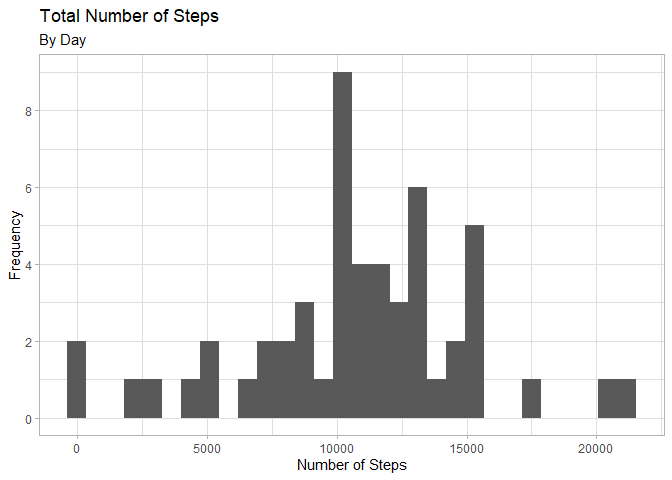
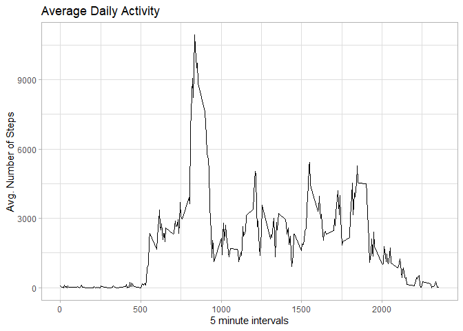
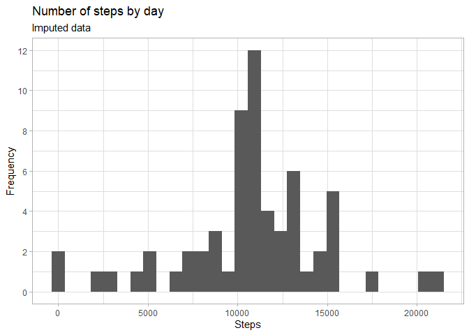
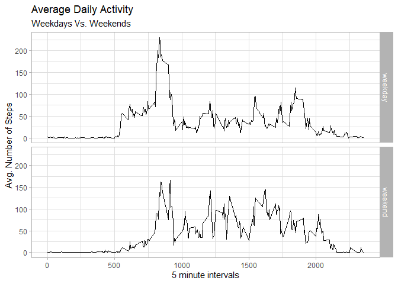

## Loading and preprocessing the data

```r
# #libraries needed
# library(tidyverse)
# library(ggplot2)

#1. and 2. Load the data and Process/transform the data (if necessary) into a format suitable for your analysis

#change "location" accordingly
location <- "C:\\Users\\Simon\\OneDrive - Emory University\\Rstats\\Coursera\\ReproducibleResearch\\Week2\\RepData_PeerAssessment1-master" 

setwd(location)

if (!file.exists("activity.csv") ) {
        unzip("activity.zip")
}

rawdf <- read.csv("activity.csv", header = TRUE)
rawdf$date <- as.Date(rawdf$date, "%Y-%m-%d") 

df <- na.omit(rawdf)

head(rawdf)
```

```
##   steps       date interval
## 1    NA 2012-10-01        0
## 2    NA 2012-10-01        5
## 3    NA 2012-10-01       10
## 4    NA 2012-10-01       15
## 5    NA 2012-10-01       20
## 6    NA 2012-10-01       25
```

```r
head(df)
```

```
##     steps       date interval
## 289     0 2012-10-02        0
## 290     0 2012-10-02        5
## 291     0 2012-10-02       10
## 292     0 2012-10-02       15
## 293     0 2012-10-02       20
## 294     0 2012-10-02       25
```


## What is mean total number of steps taken per day?


```r
### What is mean total number of steps taken per day?
#1. Calculate the total number of steps taken per day
#For this part of the assignment, you can ignore the missing values in the dataset.

steps_perday <- df %>% 
      select(steps, date) %>% 
      group_by(date) %>% 
      mutate(steps = sum(steps)) %>%
      ungroup() %>% 
      distinct()

#2. If you do not understand the difference between a histogram and a barplot, research the difference between them. Make a histogram of the total number of steps taken each day

ggplot(steps_perday, aes(x = steps)) +
      geom_histogram() +
      scale_y_continuous(breaks = seq(0,10,2)) +
      theme_light() +
      labs(
            title = "Total Number of Steps",
            subtitle = "By Day",
            y = "Frequency",
            x = "Number of Steps")
```

```
## `stat_bin()` using `bins = 30`. Pick better value with `binwidth`.
```

<!-- -->

```r
#3. Calculate and report the mean and median of the total number of steps taken per day

sum_stats_steps <- 
      steps_perday %>% 
      mutate(mean = mean(steps),
             median = median(steps)) %>% 
      select(mean, median) %>%
      distinct()
sum_stats_steps
```

```
## # A tibble: 1 x 2
##     mean median
##    <dbl>  <int>
## 1 10766.  10765
```
The mean is 10766.19.

The median is 10765 


## What is the average daily activity pattern?


```r
###What is the average daily activity pattern?
#1.Make a time series plot of the 5-minute interval (x-axis) and the average number of steps taken, averaged across all days (y-axis)

steps_interval <- df %>% 
      group_by(interval) %>% 
      mutate(steps = sum(steps)) %>%
      ungroup() %>%
      select(steps, interval) %>% 
      distinct()

ggplot(steps_interval, aes(x = interval, y = steps)) +
      geom_line() +
      theme_light() +
      labs(
            title = "Average Daily Activity",
            x = "5 minute intervals",
            y = "Avg. Number of Steps"
      )
```

<!-- -->

```r
#Which 5-minute interval, on average across all the days in the dataset, contains the maximum number of steps?

max_interval <- steps_interval %>% arrange(desc(steps)) %>% .[1,]
max_interval
```

```
## # A tibble: 1 x 2
##   steps interval
##   <int>    <int>
## 1 10927      835
```

The maximum average number of steps in a single interval was 10927 and the corresponding interval was number 835


## Imputing missing values


```r
#Imputing missing values
#1. Calculate and report the total number of missing values in the dataset (i.e. the total number of rows with NAs
NAs <- sum(is.na(rawdf$steps))
NAs
```

```
## [1] 2304
```

```r
#2. Devise a strategy for filling in all of the missing values in the dataset. The strategy does not need to be sophisticated. For example, you could use the mean/median for that day, or the mean for that 5-minute interval, etc.

# I create rawdf_imp as the original dataframe without NAs, using the mean for the 5 minutes interval instead

#3.Create a new dataset that is equal to the original dataset but with the missing data filled in. 
rawdf$steps <- as.numeric(rawdf$steps)
rawdf_imp <- rawdf %>%
      group_by(interval) %>%
      mutate(steps = ifelse(is.na(steps),
                                mean(steps, na.rm = TRUE),
                                steps)) %>% 
      ungroup()

head(rawdf_imp)
```

```
## # A tibble: 6 x 3
##    steps date       interval
##    <dbl> <date>        <int>
## 1 1.72   2012-10-01        0
## 2 0.340  2012-10-01        5
## 3 0.132  2012-10-01       10
## 4 0.151  2012-10-01       15
## 5 0.0755 2012-10-01       20
## 6 2.09   2012-10-01       25
```

```r
rawdf_imp_day <- rawdf_imp %>% 
      group_by(date) %>% 
      mutate(steps = sum(steps, na.rm = TRUE)) %>% 
      ungroup() %>% 
      select(steps, date) %>% 
      distinct()

#4. Make a histogram of the total number of steps taken each day 
      
ggplot(rawdf_imp_day, aes(x = steps)) +
      geom_histogram() +
      scale_y_continuous(breaks = seq(0,12,2)) +
      theme_light() +
      labs(
            title = "Number of steps by day", 
            subtitle = "Imputed data",
            x = "Steps", 
            y = "Frequency"
      )
```

```
## `stat_bin()` using `bins = 30`. Pick better value with `binwidth`.
```

<!-- -->

```r
#and Calculate and report the mean and median total number of steps taken per day. Do these values differ from the estimates from the first part of the assignment? What is the impact of imputing missing data on the estimates of the total daily number of steps?

sum_stats_steps_imp <- rawdf_imp_day %>%
      summarise(mean = mean(steps), median = median(steps))
```
For the imputed dataset, the maximum average number of steps in a single interval was 10766.19 and the corresponding interval was number 10766.19


## Are there differences in activity patterns between weekdays and weekends?


```r
###Are there differences in activity patterns between weekdays and weekends?

#Create a new factor variable in the dataset with two levels – “weekday” and “weekend” indicating whether a given date is a weekday or weekend day.

weekly <- rawdf_imp %>% 
      mutate(weekdays = ifelse(weekdays(date) %in% c("Saturday", "Sunday"), "weekend", "weekday"))
weekly$weekdays <- as.factor(weekly$weekdays)

weekly <- weekly %>% 
      select(-date) %>% 
      group_by(weekdays, interval) %>% 
      mutate(steps = mean(steps, na.rm = TRUE)) %>%
      ungroup() %>% 
      distinct() %>% 
      arrange(interval)

#Make a panel plot containing a time series plot of the 5-minute interval (x-axis) and the average number of steps taken, averaged across all weekday days or weekend days (y-axis). See the README file in the GitHub repository to see an example of what this plot should look like using simulated data.

ggplot(weekly, aes(x = interval, y = steps)) +
      geom_line() +
      facet_grid(weekdays ~ .) +
      theme_light() +
      labs(
            title = "Average Daily Activity",
            subtitle = "Weekdays Vs. Weekends",
            x = "5 minute intervals",
            y = "Avg. Number of Steps"
      )
```

<!-- -->
